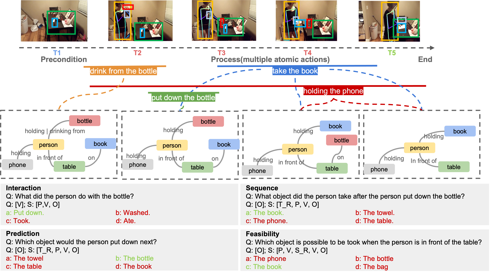

## STAR: A Benchmark for Situated Reasoning in Real-World Videos

<div align="center">

</div>

Reasoning in the real world is not divorced from situations. A key challenge is to capture the present knowledge from surrounding situations and reason accordingly. STAR is a novel benchmark for Situated Reasoning, which provides challenging question-answering tasks, symbolic situation descriptions and logic-grounded diagnosis via real-world video situations.

## Overview

* 4 Qutestion Types
* 60k Situated Questions
* 23k Situation Video Clips
* 140k Situation Hypergraphs

## Data Download

To download STAR dataset, please refer to the [STAR Homepage](http://star.csail.mit.edu)

* Frame Dumping Tool 

	To get keyframes in each video, please follow the instruction in [Action Genome](https://github.com/JingweiJ/ActionGenome). Please note that graph annotations offered by STAR use the same frame index generated by the above dumping tool.

* Video Clips

	We offer video star and end time of each QA in [Video Segments.csv](https://stardata.s3.amazonaws.com/Situation_Video_Data/Video_Segments.csv), and keyframes index in [Video Keyframe IDs](https://stardata.s3.amazonaws.com/Situation_Video_Data/Video_Keyframe_IDs.csv). You can use them to get the same video clips used in STAR.

## Online Evaluation

You are welcome to use [STAR Challenge Leaderboard](https://eval.ai/web/challenges/challenge-page/1325/overview) for the online evaluation on the test dataset.

## STAR Visulazation

We prodive `code/QA_Visualization.ipynb` to visualize Question / Options / Video / Situation Graphs in STAR.
 * before visualization, please download the Supporting Data (include video keyframes from Action Genome and original videos from Charades) and place them in the mentioned directories in the scripts.

## STAR Program Execution

In STAR, we introduce a neuro-symbolic framework Neuro-Symbolic Situated Reasoning (NS-SR) to get answers by executing programs with corresponding situation graphs.
run

 * `python run_program.py --qa_dir your_path`

to utlize STAR program excutor.

## STAR Generation

We prodive `code/QA_generation.ipynb`, you can generate new STAR questions for situation video clips

## Citation STAR

If you use STAR in your research or wish to refer to the results published in the paper, please use the following BibTeX entry.

```BibTeX
@inproceedings{wu2021star_situated_reasoning,
author={Wu, Bo and Yu, Shoubin and Chen, Zhenfang and Tenenbaum, Joshua B and Gan, Chuang},
title = {{STAR}: A Benchmark for Situated Reasoning in Real-World Videos},
booktitle = {Thirty-fifth Conference on Neural Information Processing Systems (NeurIPS)},
year = {2021}
}
```

## STAR Data Outline

### Question, Multiple Choice Answers and Situation Graphs  
 * Questions and Answers (.json) : [Train](http://star.csail.mit.edu/data/Question_Answer_SituationGraph/STAR_train.json) [Val](http://star.csail.mit.edu/data/Question_Answer_SituationGraph/STAR_val.json) [Test](http://star.csail.mit.edu/data/Question_Answer_SituationGraph/STAR_test.json)
 * [Train/Val/Test Split File (.json)](http://star.csail.mit.edu/data/Question_Answer_SituationGraph/split_file.json)

### Question-Answer Templates and Programs  
 * [Question Templates (.csv)](http://star.csail.mit.edu/data/Templates_Programs/QA_templates.csv)
 * [QA Programs (.csv)](http://star.csail.mit.edu/data/Templates_Programs/QA_programs.csv)

### Situation Video Data  
 * [Video Segments (.csv)](http://star.csail.mit.edu/data/Situation_Video_Data/Video_Segments.csv)
 * [Video Keyframe IDs (.csv)](http://star.csail.mit.edu/data/Situation_Video_Data/Video_Keyframe_IDs.csv)
 * [Frame Dumping Tool from Action Genome](https://github.com/JingweiJ/ActionGenome)

### Annotations  
 * [Human Poses (.zip)](http://star.csail.mit.edu/data/Annotations/pose.zip)
 * [Object Bounding Boxes (.pkl)](http://star.csail.mit.edu/data/Annotations/object_bbox_and_relationship.pkl)
 * [Human Bounding Boxes (.pkl)](http://star.csail.mit.edu/data/Annotations/person_bbox.pkl)

### Supporting Data  
Our bench built upon [Charades Dataset](https://prior.allenai.org/projects/charades) and [Action Genome](https://www.actiongenome.org), please download raw videos from Charades Dataset as follows:
* Video Frames
  * [Raw Videos from Charades Dataset (scaled to 480p)](https://prior.allenai.org/projects/charades)
* Video Features
  * [Visual Features from Charades Dataset](https://prior.allenai.org/projects/charades)

### STAR Visulization
We prodive some QA examples in STAR which you can visulize by using [QA Visualization Script](https://github.com/csbobby/STAR_Benchmark)
 * before visualization, please download the Supporting Data (include video keyframes from Action Genome and original videos from Charades) and place them in the mentioned directories in the scripts.

### STAR Generation
We also prodive our QA generation code, you can generate new STAR questions from more situation videos: [QA Generation Code](https://github.com/csbobby/STAR_Benchmark)


